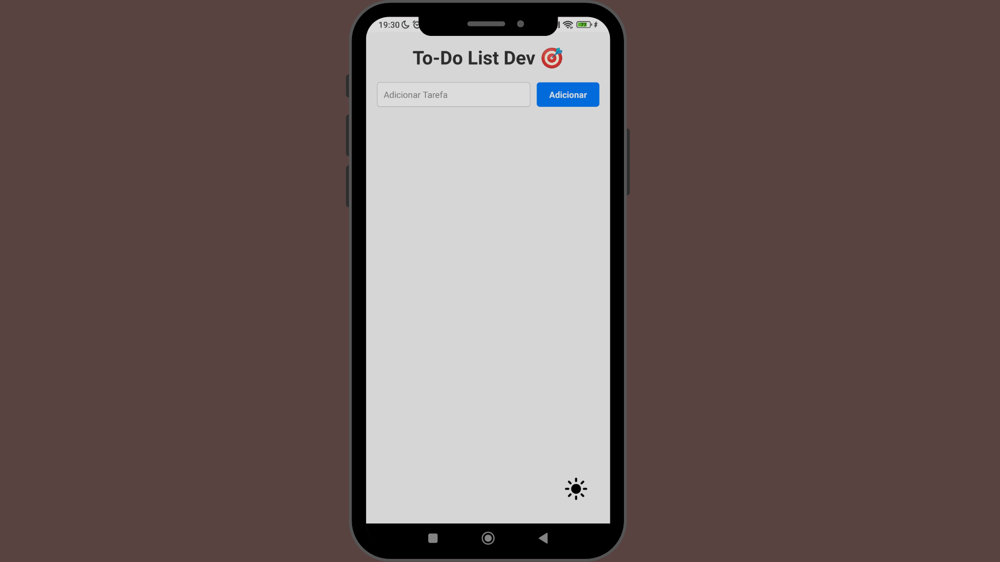

  

###

<h2 align="center">To-do List Dev 🎯</h2>

###

Um aplicativo que desenvolvi no intuito de auxiliar qualquer pessoa a organizar suas tarefas diárias onde você no app adiciona uma tarefa diária e pode colocar descrição nas suas tarefas desde de as mais especificas até as mais abrangentes

###

<h2 align="left">💻 Tecnologias utilizadas:</h2>

###

  
  
  

###

<h2 align="left">🎯 Pontos principais no projeto</h2>

###

👨‍💻 Utilização do expo para auxiliar na construção e build do aplicativo.  📱  Utilização do react para criação do aplicativo.

###

📌 Quer trocar uma ideia ou colaborar?

###

<h1 align="left">📃 Instalação do projeto</h1>

###

Você pode instalar e testar o aplicativo instalando o apk

###

Ou instalar ele na sua máquina da seguinte forma:

###

<h1 align="left">Quer trocar uma ideia ou colaborar?</h1>

###

  
  
  

###
